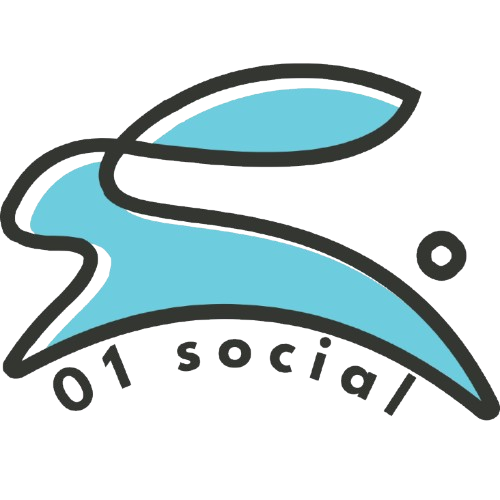

# Social-Network-V2

<div align="center">
  
</div>

Un réseau social complet : publications, groupes, événements, messagerie instantanée
et notifications en temps réel.

Le backend est écrit en **Go** sur une base **SQLite**, le frontend en **Next.js**.
En production, les deux tournent derrière un proxy **Caddy**, sur une seule origine.

---

## Démarrage rapide

```bash
./run.sh
```

Puis ouvrez <http://localhost:3000> dans votre navigateur.
`Ctrl-C` arrête les deux services.

C'est la seule commande nécessaire. Le script vérifie les outils installés, contrôle
que les ports sont libres, installe les dépendances frontend au premier lancement,
démarre les deux services et affiche les logs fusionnés.

### Prérequis

| Outil | Version | Vérifier avec |
| --- | --- | --- |
| Go | 1.24 ou plus | `go version` |
| Node.js | 20 ou plus | `node -v` |
| npm | fourni avec Node.js | `npm -v` |

L'installation des dépendances npm est automatique, aucun `npm install` manuel n'est
requis. Il n'y a pas non plus de fichier `.env` à configurer.

### Ce qui démarre

| Service | Technologie | Port | Adresse | Logs |
| --- | --- | --- | --- | --- |
| Backend | Go, `net/http` + SQLite | 8080 | <http://localhost:8080> | `/tmp/social-network-v2/backend.log` |
| Frontend | Next.js (App Router) | 3000 | <http://localhost:3000> | `/tmp/social-network-v2/frontend.log` |

Les logs s'affichent aussi dans le terminal, chaque ligne préfixée par `backend` ou
`frontend` pour rester lisible quand les deux services parlent en même temps.

---

## Les deux modes d'exécution

Le projet se lance de deux façons, et **le port d'accès diffère**. C'est la principale
source de confusion.

| Mode | Commande | Adresse de l'application |
| --- | --- | --- |
| Développement (recommandé) | `./run.sh` | <http://localhost:3000> |
| Docker | voir [Docker](#docker) | <http://localhost:8080> |

En mode Docker, Caddy sert le frontend, l'API et les fichiers envoyés depuis le port
8080. Il n'y a donc **pas** de serveur Next.js sur le port 3000 dans ce mode.

---

## Fonctionnalités

- **Comptes** — inscription avec avatar, connexion par cookie de session, déconnexion, état de session
- **Publications** — fil d'actualité, création, modification, suppression, réactions
- **Groupes** — création, adhésion, invitations, departures, publications et messages propres à chaque groupe
- **Événements** — création et réponses aux événements d'un groupe
- **Messagerie** — conversations privées et de groupe, accusés de lecture, temps réel par WebSocket
- **Notifications** — liste, marquage comme lu, vidage
- **Abonnements** — demandes d'abonnement, validation, désabonnement, liste d'abonnés, amis
- **Profils** — modification, réglages de confidentialité, suggestions, recherche d'utilisateurs
- **Fichiers** — envoi d'images et d'avatars, servis depuis `/uploads/`
- **Temps réel** — notifications par SSE (`/api/events`) et messagerie par WebSocket (`/api/ws/chat`)

---

## Organisation du projet

| Chemin | Rôle |
| --- | --- |
| `backend/` | Serveur Go : handlers, base de données, auth, chat |
| `backend/internal/handler/` | Handlers HTTP, un par route |
| `backend/internal/repository/` | Requêtes SQL et état partagé |
| `backend/internal/Initialdb/` | Ouverture SQLite et application des migrations |
| `backend/pkg/db/migrations/sqlite/` | **Migrations de schéma** (voir [Données](#données-et-stockage)) |
| `backend/database/` | Fichier SQLite `forum.db` et quelques `.sql` de référence |
| `backend/uploads/` | Avatars et images envoyés par les utilisateurs |
| `frontend/` | Application Next.js (App Router) |
| `frontend/src/app/lib/api.js` | **Point d'entrée unique** pour les URLs backend, WebSocket et uploads |
| `docker/` | Dockerfiles, stack Compose et configuration Caddy |
| `deploy/` | Scripts de déploiement et documentation |
| `docs/` | Documentation de l'API |
| `run.sh` | Lance backend et frontend ensemble |

---

## Données et stockage

La base est un fichier SQLite unique, `backend/database/forum.db`. Au démarrage, le
backend l'ouvre et applique les migrations manquantes avec **golang-migrate**, sans
aucune commande à lancer. Le schéma est donc à jour automatiquement.

**Pour ajouter ou modifier le schéma**, ajoutez un fichier dans
`backend/pkg/db/migrations/sqlite/` nommé `000015_description.up.sql` (et son
`.down.sql`). N'ajoutez pas de `.sql` dans `backend/database/` : ces fichiers ne sont
pas appliqués au démarrage.

> Ce fichier est volontairement suivi par Git, comme les images envoyées. Si vous
> clonez le dépôt sur un serveur, exécutez `git update-index --skip-worktree
> backend/database/forum.db` une fois : l'application écrit dans ce fichier, et sans
> cette commande le prochain `git pull` entrera en conflit.

---

## Lancer un seul service

Quand vous n'avez besoin que d'une moitié, par exemple pour travailler uniquement sur
le frontend :

```bash
# Backend seul
cd backend && go run main.go
```

```bash
# Frontend seul (nécessite le backend sur le port 8080)
cd frontend && npm run dev
```

En lançant le frontend seul, indiquez l'URL du backend si elle change :

```bash
cd frontend && NEXT_PUBLIC_API_URL=http://localhost:8080 npm run dev
```

Le backend écoute sur le port défini par la variable d'environnement `PORT`, et sur
`8080` par défaut.

---

## Docker

```bash
docker compose -p social -f docker/docker-compose.yml -f docker/docker-compose.local.yml up -d --build
```

L'application est ensuite disponible sur <http://localhost:8080>. Le paramètre `-p social`
nomme le projet Compose et évite les conflits de nom avec d'autres stacks locales.

Pour arrêter :

```bash
docker compose -p social -f docker/docker-compose.yml -f docker/docker-compose.local.yml down
```

---

## Dépannage

**« port already in use » ou « port is already allocated »**
Un autre processus occupe le port. Le script affiche le PID fautif ; arrêtez-le avec
`kill <pid>`. Les ports utilisés sont `8080` (backend) et `3000` (frontend).

**« go / node / npm executable not found »**
Un prérequis manque. Voir le [tableau des prérequis](#prérequis).

**Le frontend affiche des erreurs réseau**
Le backend n'est pas démarré ou n'écoute pas sur le port 8080. Dans `./run.sh`, les
deux services démarrent ensemble. En lançant le frontend seul, indiquez
`NEXT_PUBLIC_API_URL`.

**Le navigateur charge mais l'API renvoie des erreurs 404**
Vous avez probablement ouvert le mauvais port. En Docker, l'application est sur `8080`,
pas sur `3000`.

**Repartir d'une base propre**
Arrêtez les services, supprimez `backend/database/forum.db`, relancez : le schéma est
recréé par les migrations. Les images envoyées dans `backend/uploads/` ne sont pas
concernées.

---

## Production

Le déploiement utilise la même stack Docker, avec Caddy en terminaison TLS. Les
scripts et la marche à suivre sont dans [`deploy/README.md`](deploy/README.md).

---

## Pour aller plus loin

La documentation détaillée est en anglais :

- [`backend/README.md`](backend/README.md) — architecture et conventions du backend
- [`docs/api-endpoints.md`](docs/api-endpoints.md) — les endpoints de l'API
- [`.github/instructions.md`](.github/instructions.md) — conventions pour les agents IA et les contributions
- [`deploy/README.md`](deploy/README.md) — déploiement

---

## Licence

Voir [LICENSE](LICENSE).
